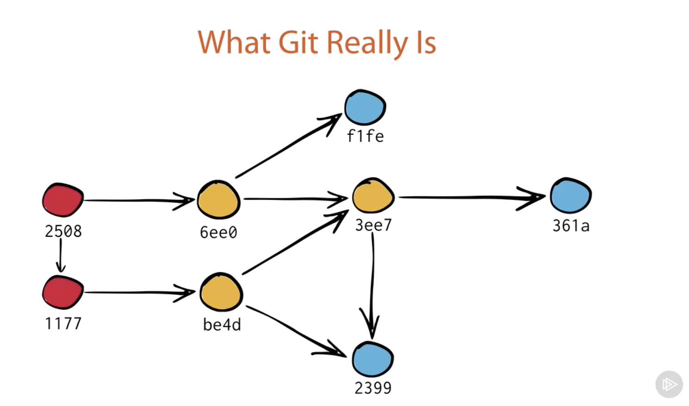

# How Git Works (Plural sight)
Link: https://app.pluralsight.com/courses/c0bcd282-3110-49e3-b2b9-94c7348f5222/table-of-contents

## **Git is an Onion(Git Object Model)**
* Distributed Revision Control System
* Revision Control System (Branches)
* Stupid Content Tracker
* Persistent Map

## Module 1: Stupid Content Tracker
## _Persistent Map_
* Values and Keys
* SHA1 Hash values
* .git/object will have the first 2 digit of the SHA1 as first dir in the object directory.

## _Versioning_
* most commits have parents
* new commit will point to the new sha1
* and also have a parent sha1 pointing to the previous branch
* the new commit will point to the same sha1 if the files aren't changed
* git might decide to store only the differences (optimization)

## _Tag_
Annotated Tags
* come with the messages
* git tag -a mytag -m "I love cheesecake"
* tag is a simple lable attached to an object

## _Git Objects_
* Blobs
* Trees
* Commits
* Annotated Tags

## _Git Object Model_
* High level file system
* Versioned file system

## Module 2: Revision Control System-Branching and Merging
## _Branches_
* .git/refs/head/master
* git branch branchname
* current branch:
	* .git/HEAD should contain which is the current branch
	* reference to the ref branch
* Checkout: Move head modify the active files.
* Merging the same file with differences:
	* Conflict
	* solve the conflict manually
	* Merge is like other commits but with 2 parents.

## _Merging without Merging_
* merge master in Lisa
* moves lisa to master >> _Fast-forward_

## _Detached Head_
* HEAD points to a commit instead of a branch
* the working branch isn't a branch at all
* we can still commit here, Head will behave like a branch
* but we can easily revert all the commits by checking out to the master branch
* all the commit made when we checkout the commit hash will be unreachable
* if we want to save it then we can still create a branch at this point or checkout the branch name that git has given usually a sequence of numbers
* Use Case: Experimenting.

## _Git Object Model, Extended_
* 3 Rules:
	* the current branch tracks new commits
	* when you move to another commit, Git updates your working director
	* unreachable objects are garbage collected

## Module 3: Revision Control System-Rebasing

## _Rebase_
* updated the base of the branch
* goes to the first same commit between between 2 branches
* detaches the remaining branches
* and attaches the commits to the last commit of the rebase branch

* _detail_:
	* Rebase actually the new commits are created with the exact same contect of the commits that are being rebased.
	* What happens to the old commits?
		* the old commits are most likely unreachable
		* and get garbage collected

## _Tradeoffs of Merge_
* preserves history exactly as it happened
* will also include fixes to commits
* but in big projects it can be really hard to understand
* git log can also be misleading as it shows logs one after the other but that is not how the commits were made
* sometimes history can be confusing
* but Merges never lie,

## _Tradeoffs of Rebase_
* streamilined and clean
* helps refactor history.
* but the history is not true.
* Some git commands require history
* multiple commits with same commit mesage in the branch
* **_When in doubt use Merge._**

## _Tags_
* 2 types of tags: annotated, and lightweight tags
* Lightweight tags:
	* While branches move tags don't.
	* It just points to a commit.
	
## Module 4: Distributed Revision Control
* .git/config
* each git repository has info about other repos
* origin is the default repo
* like a local branch, a remote branch is just a reference to a commit
* write the chagnes to the remote: git push
* get the changes fromt he remote: git pull
* the sync not just copys the missing objects but also need to sync branches and tags.
* when there is a conflict when pushing to the remote:
	* git fetch
	* git merge origin/master
	* git push
* fetch and merge: git pull
* _You pull then you push_
* this conflic with addition to another user:
	* tradoff of the reabse
	* never rebase shared commits

## _Github Features_
* _Fork_:
	* kindof like a clone but for our own project
	* github knows that the two repos are connected but git doesn't
	* so the original repo is called _upstream_
	* our remote repo is calle d origin
	* we can send the changes we made to the upstream by _Pull Request_

