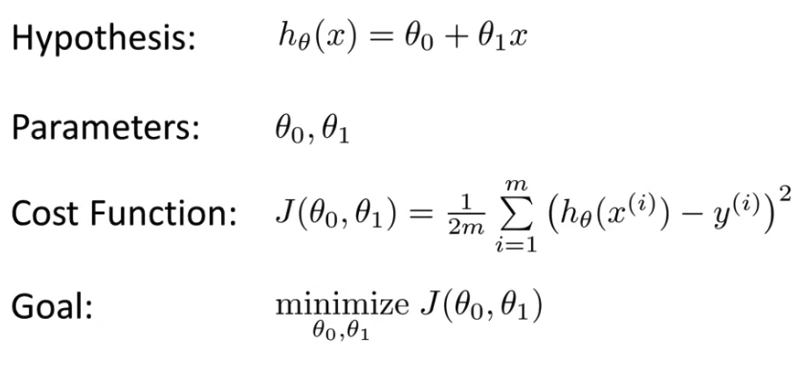

# Linear Regression with one variable
_May 2, 2020_

## **_Model and Cost Function_**
- Housing Prices:
	- graph- size vs price
	- supervised learning: given right answer to each example in the data
	- regression problem: predict the price given the size
	- Training Set: Learn from this set
	- m: Number of training examples
	- x = input variables - features
	- y = output variable - target
	- (x,y) = one training example
	- (x^i, y^i) = ith training example
	- X: space of input variables
	- Y: space of output values
- Training set - learning algorithm - hypothesis - estimated price - h: X->Y
- how do we represent the h:
	- h0(x) = theta-0 +theta-1 . x
	- linear regression with one variable 
	- Univariate linear regression

## **_Cost Function_**
- Hypothesis for housing problem is linear regression
- Choose the value of theta-0 and theta-1 so that h(x) is close to y for the Training set 
- minimize[theta-0 theta-1]  -- 1/2m .  Summation[i=1-m] (h(x[i]) - y[i]))^2
- Cost function: J(theta-0, theta-1) : Squared error function ^^
- most commonly used for regression problems

h-theta(x): for fixed theta-1 is a function of x

J(theta-1): function of the parameter theta-1 <- Cost Function
	- J(1)=0 when h-theta-1(x) = y, Theta-1 =1
	- when theta-1 = 0.5, J(0.5) = 0.58
	- Theta-1 = 1 is our global minimum
	- because the graph for the cost function looks like parabola

### Contour Plots/Figures:

- 2 parameters J(theta-0, theta-1)
- graph a surface
- NOTE: might need to re-learn this

NOTE: Please relearn: Cost Function Intuition-1 and Intuition-ii

## **_Parameter Learning:_**
### **_Gradient Descent Algorithm_**
- getting the minimum cost theta-0 to theta-n
- start off with theta-0 and theta-1
- := is assignment operator
- alpha = learning rate
- correct simultaneous update
- derivitive term

